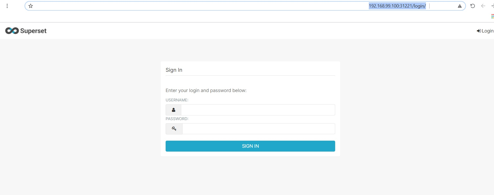

# superset

## command set

```
kubectl create deployment superset --image amancevice/superset:latest --dry-run -o yaml > superset_deployment.yml
kubectl expose deployment superset --type=NodePort --port=8088 --dry-run -o yaml > superset_service.yml
kubectl apply -f superset_deployment.yml
kubectl apply -f superset_service.yml
```

## finding minikube's IP
minikube ip<br/> 
example result: 192.168.99.100

## finding service nodeport port
kubectl describe service superset

```
Name:                     superset
Namespace:                default
Labels:                   app=superset
Annotations:              <none>
Selector:                 app=superset
Type:                     NodePort
IP Families:              <none>
IP:                       10.104.20.9
IPs:                      10.104.20.9
Port:                     <unset>  8088/TCP
TargetPort:               8088/TCP
NodePort:                 <unset>  31221/TCP
Endpoints:                172.17.0.5:8088
Session Affinity:         None
External Traffic Policy:  Cluster
Events:                   <none>
```
  
## access superset from web browser
http://[minikube ip]:[NodePort]<br/>
example: http://192.168.99.100:31221

## expected output

